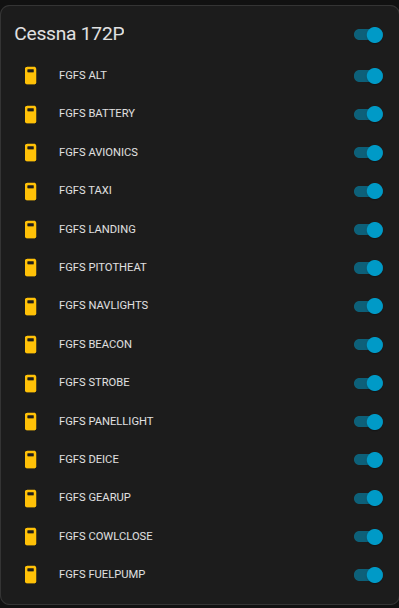
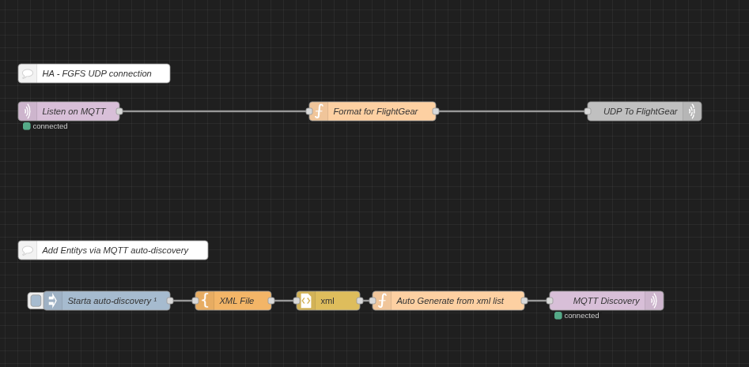

# FGFS DRIVER FOR SAITEK SWITCH PANEL

This project provides an interface between FlightGear Flight Simulator and Home Assistant. Operation of switches in Home Assistant is reflected in the simulator. 

This software loads a configuration that maps the MQTT topics to the **FGFS** simulator properties.

This project is the successor to daibach142/FGFS_Saitek_Switch_Panel on GitHub.
For problems or issues, please enter an issue on GitHub: https://github.com/zipperten/homeassistant-fgfs

---

## INSTALLATION

### Linux

I have only got this working with the apt version, the appimage version do not seam to fin my saitekswitch.xml file 

1. Download and extract the software from [here](https://github.com/zipperten/homeassistant-fgfs). 
2. Run `sudo make install` in a terminal
3. Import `ha-fgfs_noderedflow.json` into Node-RED.
4. Setup your ip and security for your mqtt broker in the mqtt node
5. Setup ip for your fgfs machine in the "UDP To FlightGear" node
6. Deploy, green connected icons should appear under mqtt nodes
7. Click the blue Auto-discovery node in the node red flow to generate the MQTT properties.
8. Add the generated entities to a Home Assistant panel. You can have a look at `hadashboard.yaml`.
9. Start FGFS with `fgfs --generic=socket,in,20,,60000,udp,saitekswitch` or add `--generic=socket,in,20,,60000,udp,saitekswitch` in the launcher settings. 

10. Try the breakers, and keep the blue side up!

 
---

### Note

It's an early project, I'm glad to receive suggestions or help to improve the code. 

---

## RUNNING

Note that the Switch Panel software is configured at startup for a
specific aircraft using a configuration file. Files for the Cessna 172P and Piper 28-116 are currently provided, see `CONFIGURATION` for roll-your-own.

Start FGFS with `fgfs --generic=socket,in,20,,60000,udp,saitekswitch` or add the following start option to FlightGear configuration:

	...
	--generic=socket,in,20,,60000,udp,saitekswitch
	...

---
  

---
Have a look at this later, I do not know if this is relevant with MQTT switches.  

### SWITCH elements

There are 13 **`switch`** elements, edit each one to configure the panel switch to the aircraft configuration, possibly using the 'properties' window in the simulator. A switch toggles the specified property by sending 1 (on) or 0 (off); this works for FGFS bool, integral or double-precision values. Note that the current switch state is maintained within this driver software, and is not read from the simulator. It is **`MANDATORY`** to provide all 13 elements.

---
